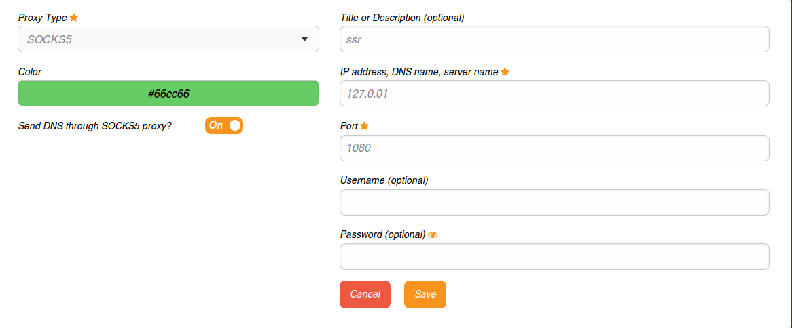

**本文是ubuntu使用方法汇总。**

### 参考资料

1. [双系统安装](https://jingyan.baidu.com/article/60ccbceb18624464cab197ea.html)
2. [ubuntu下安装nodejs](http://www.jianshu.com/p/2b24cd430a7d)
3. [ubuntu安装webstorm](http://blog.csdn.net/txl910514/article/details/52136821)
4. [ubuntu下多个python版本切换](https://www.cnblogs.com/netfoxman/p/5994697.html)
5. [ubuntu安装中文字体](http://blog.csdn.net/wangjingfei/article/details/5614203)
6. [ubuntu下deb包的安装方法](http://blog.csdn.net/kevinhg/article/details/5934462)
7. [ubuntu下科学上网配置](https://github.com/shadowsocks/shadowsocks-qt5/wiki/%E5%AE%89%E8%A3%85%E6%8C%87%E5%8D%97)

### 说明

1. 上述第7个链接只是**shadowsocks-qt5**的安装，火狐浏览器安装FoxyProxy Standard插件，并进行如下配置：

   

